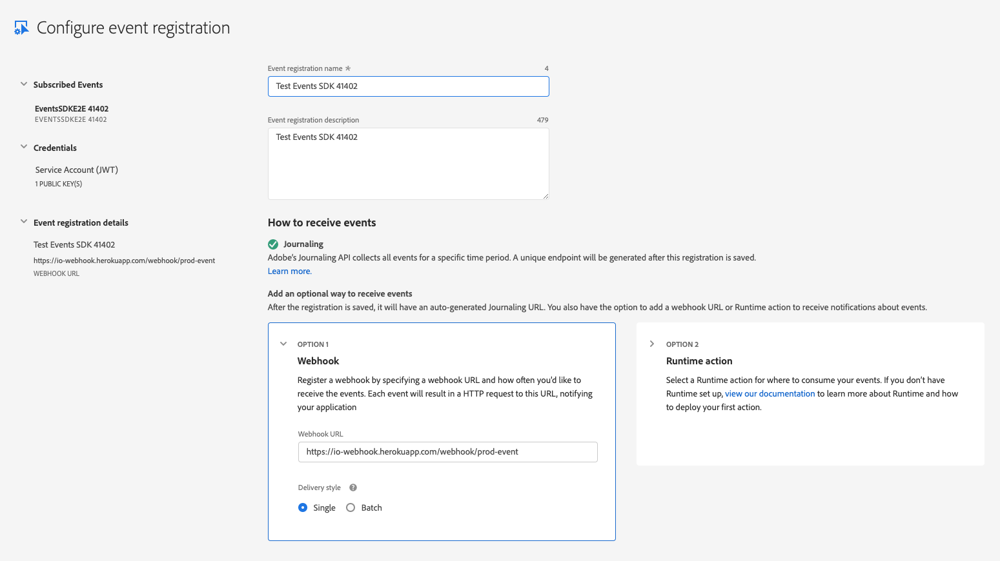

## Lesson 4: Ensure Events are published

After using event SDK to create a event provider, you will see event provider registrated in console
 

### Using Journaling API consume events 
For enterprise developers, Adobe offers another way to consume events besides webhooks: journaling. The Adobe I/O Events Journaling API enables enterprise integrations to consume events according to their own cadence and process them in bulk. Unlike webhooks, no additional registration or other configuration is required; every enterprise integration that is registered for events is automatically enabled for journaling. Journaling data is retained for 7 days 

After you fire event, you should be able to verify your event through journaling `UNIQUE API ENDPOINT` you get from console
[Journaling api](https://www.adobe.io/apis/experienceplatform/events/docs.html#!adobedocs/adobeio-events/master/intro/journaling_api.md)

### Using webhook to consume events 
You could configure antoher event delivery method through console by `Edit Events Registration` and add webhook 

Follow the link below 
[how to use webhook](https://www.adobe.io/apis/experienceplatform/events/docs.html#!adobedocs/adobeio-events/master/intro/webhook_docs_intro.md)
or simple use [io webhoook](https://io-webhook.herokuapp.com/)

Next: [Well done](/lessons/welldone.md)